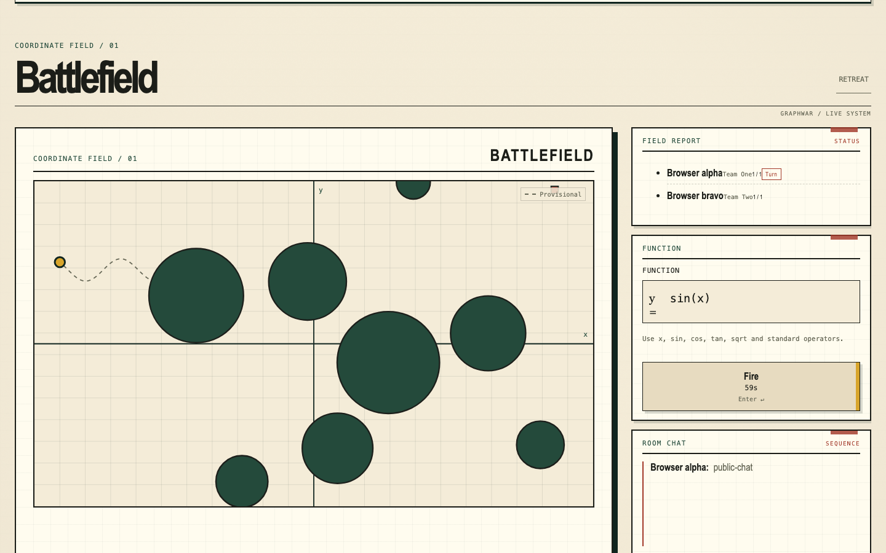

# Graphwar

Graphwar is a browser artillery game where mathematical expressions become shots on a Cartesian battlefield. Draw the line, avoid terrain and teammates, hit the opposing team.

**Play:** [graphwar.tiendepchai.id.vn](https://graphwar.tiendepchai.id.vn)



## Features

- Function, first-order ODE, and second-order ODE firing modes.
- Server-authoritative turns, collisions, deaths, terrain, and match results.
- Account registration, login, logout, session recovery, and reconnect state sync.
- Public rooms, private invite-only rooms, automatic team assignment, soldier setup, and bot slots.
- Room and in-match chat.
- Responsive, keyboard-friendly browser UI with accessible canvas descriptions.
- PostgreSQL-backed room and active-match snapshots for restart recovery.

## How to play

1. Register or sign in.
2. Create or join a public room, or join a private room with its invite code.
3. Review your assigned team, choose a soldier count and game mode, then add a bot if needed.
4. Mark yourself ready. Start when every player is ready.
5. On your turn, enter an expression, preview the path, then fire. In second-order mode, use the angle controls before firing.
6. Eliminate the opposing team.

The battlefield uses logical coordinates of `x = -25..25` and `y = -15..15`. Soldiers start on the negative-x side; Team Two sees the mirrored firing direction.

## Game modes

### Function

Enter `y = f(x)`. Graphwar translates the curve so it passes through the current soldier. Constants therefore do not change the resulting path: `2*x + 3`, `2*x - 8`, and `2*x` are equivalent shots.

### First-order differential equation

Enter `y' = f(x, y)`. The soldier position supplies the initial condition; the fired curve is the numerical solution.

Examples:

```text
y' = 3*sin(x)+2
y' = -y/3
y' = 1/(x+y)
```

### Second-order differential equation

Enter `y'' = f(x, y, y')`. The soldier position and firing angle provide the two initial conditions. Angle affects the path only in this mode.

Examples:

```text
y'' = -y + y' + 2*x - 1
y'' = 4*sin(x) + 2^x
y'' = 1.04^(-(x+y)^2)
```

## Expression syntax

Variables:

```text
x  y  y'
```

Operators:

```text
+  -  *  /  ^
```

Functions:

```text
sqrt()  log()  ln()  abs()  sin()  cos()  tan()  exp()
```

Examples:

```text
y = ((x-3)^2)/20
y = ln(abs(x))
y = sin(x/20)*5
y' = 1.2^x
y'' = (1.2^(-(x+3)^2))*(20*(-y))
```

Use parentheses to make precedence explicit. For example, write `1/(x+2)` instead of relying on `1/x+2`. Avoid curves that leave the battlefield quickly, become undefined, or exceed the allowed path length: `sqrt(abs(x))` is safer than `sqrt(x)` for soldiers on negative x.

The accepted parser rejects unknown text, unbalanced brackets, excessive expression size/depth, and non-finite results. See [`spec/parity.md`](spec/parity.md) for the compatibility checklist and deliberate browser-release differences.

## Architecture

Graphwar is a Rust workspace:

- `crates/client-wasm` — Rust/WASM browser client and canvas renderer.
- `crates/game-core` — game state, geometry, turns, collisions, and simulation.
- `crates/protocol` — versioned JSON client/server messages.
- `crates/server` — Axum HTTP/WebSocket server, authentication, rooms, bots, and snapshots.
- `migrations` — PostgreSQL schema and migrations.
- `assets/web` — static HTML/CSS and generated WASM bindings.
- `scripts/e2e.mjs` — HTTP, WebSocket, browser, accessibility, responsive-layout, and gameplay checks.
- `deploy` — Docker image and production Compose configuration.

The browser client communicates over authenticated WebSockets. The server remains the authority for every state-changing gameplay result. The legacy Java implementation remains under `src/` and `rsc/` for reference; it is not interoperable with the browser release.

## Development

Requirements: Rust 1.85+, the `wasm32-unknown-unknown` target, Docker for image checks, and Node.js 22+ for browser E2E.

Install the WASM target once:

```sh
rustup target add wasm32-unknown-unknown
```

Run the repository checks:

```sh
cargo fmt --all --check
cargo clippy --workspace --all-targets -- -D warnings
cargo test --workspace
cargo check -p graphwar-client-wasm --target wasm32-unknown-unknown
```

Build the production image:

```sh
docker build -f deploy/Dockerfile .
```

The server requires PostgreSQL, `DATABASE_URL`, and `ALLOWED_ORIGINS`. For local development, use a disposable PostgreSQL instance and set `BIND_ADDR=127.0.0.1:8080`, `SECURE_COOKIES=false`, `GRAPHWAR_STATIC_DIR=assets/web`, plus the matching origin. Start the server with:

```sh
cargo run -p graphwar-server
```

Run browser delivery checks against a running server:

```sh
node scripts/e2e.mjs http://127.0.0.1:8080
```

## Docker Compose deployment

The production stack uses `deploy/compose.yaml` for Graphwar, PostgreSQL, and `cloudflared`. The app shares the Cloudflare Tunnel network namespace; the tunnel routes its public hostname to `http://127.0.0.1:18081`. PostgreSQL has no host port and remains on the internal database network.

1. Copy `.env.example` to `.env`.
2. Set a strong `POSTGRES_PASSWORD`, the public `DOMAIN`, and `CLOUDFLARE_TUNNEL_TOKEN_FILE`.
3. Store the Cloudflare tunnel token in the configured file. Keep that file outside Git; it is ignored by `.gitignore`.
4. Configure the Cloudflare Public Hostname to route the domain to `http://127.0.0.1:18081`.
5. Start and inspect the stack:

```sh
cp .env.example .env
# Edit .env, then place the tunnel credential in the configured token file.
docker compose --env-file .env -f deploy/compose.yaml up -d --build --wait
docker compose --env-file .env -f deploy/compose.yaml ps
docker compose --env-file .env -f deploy/compose.yaml exec app wget -qO- http://127.0.0.1:18081/healthz
```

Never paste tunnel tokens, database passwords, or `.env` contents into commits, chat, or logs. Changing `POSTGRES_PASSWORD` does not rotate an existing PostgreSQL role in an existing volume; perform credential rotation as a controlled database operation.

## License

GPL-3.0-or-later
